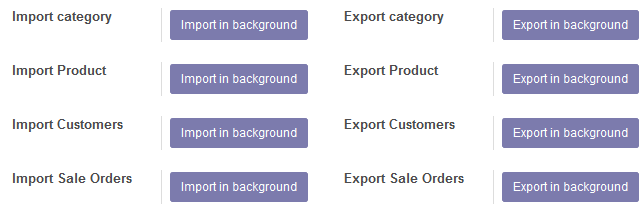

此文档使用 `Sphinx <http://www.sphinx-doc.org/>`_ 工具创建。文中多数示意图采用UML标准，利用 `PlantUML <http://plantuml.com/>`_ 工具绘制。

此模块依赖 `Odoo Connnector <http://odoo-connector.com/>`_ 实现商品(包括类别)，客户，销售三大类数据在Odoo与WooCommerce系统之间的同步。
由于 *Odoo Connnector* 利用了 `Job Queue <http://odoo-connector.com/guides/concepts.html#jobs-queue>`_ 模块，可以实现 **列队** 功能。故在大数据量条件下也可保证性能。

Odoo系统安装此模块后，所实现的功能请参考：

.. image:: _images/use_case.png
   :target: _images/use_case.png

仅有管理员用户可以使用（可见下面界面）。

所有“Import ...” 按键触发

#. 从WooCommerce系统导出数据（全部）
#. 处理后导入Odoo系统.

而所有“Export ...” 按键触发相反过程。

运行流程：

#. Import

   .. image:: _images/activity_import.png
      :target: _images/activity_import.png

#. Export

   .. image:: _images/activity_export.png
      :target: _images/activity_export.png

源码中涉及到的类，及相互关系：

.. image:: _images/classes.png
   :target: _images/classes.png

在Odoo框架下开发的应用模块，所包含的参数类型优先考虑Odoo模型定义类型(odoo.fields.*)。比如 *odoo.fields.Char* 。

Odoo 与Odoo Connector数据模型都以“.”作为分隔符，但在PlantUML语法中会产生歧义。为此用“_”代替。
类示意图中，名为“wc_backend”的类在源码中名为“wc.backend”。
